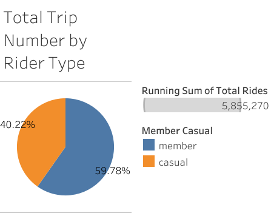
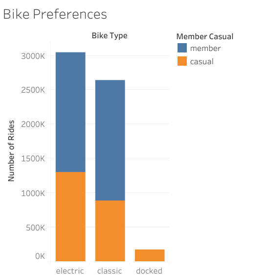
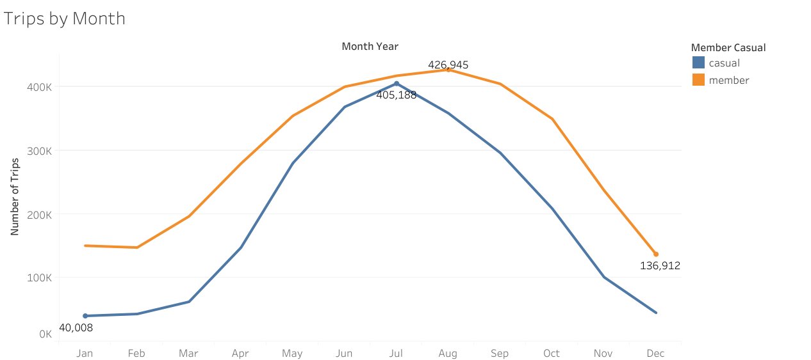
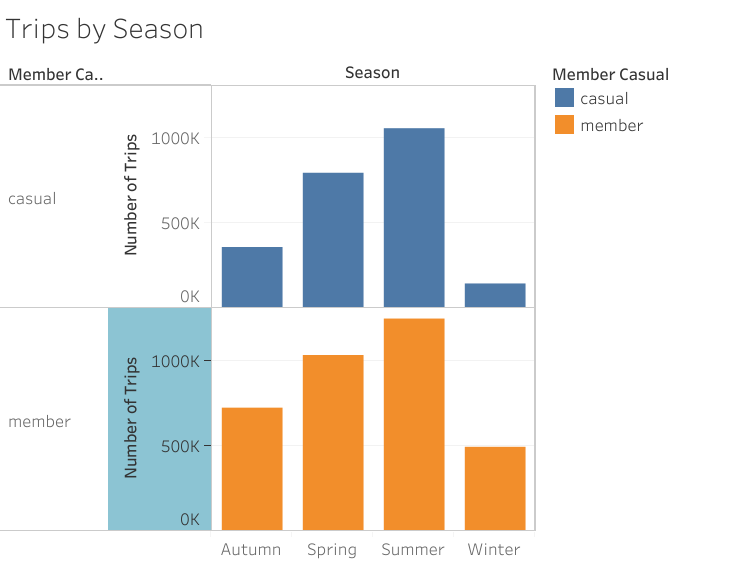

# THE CYCLISTIC BIKE SHARE ANALYSIS CASE STUDY

In this Cyclistic bike-share analysis case-study, in order to answer the key business questions, I will follow the steps of the data analysis process: ask, prepare, process, analyze, share, and act.

## Scenario
I work as a junior data analyst in the marketing analyst team at Cyclistic, a bike-share company in Chicago. The director of marketing believes the company’s future success depends on maximizing the number of annual memberships. Therefore, our team wants to understand how casual riders and annual members use Cyclistic bikes differently. From these insights, our team will design a new marketing strategy to convert casual riders into annual members. 

For detailed information **about the company**, please, follow the [link](./About_Cyclistic.md).

## 1. ASK

### Business Task (problem to solve):
Design marketing strategies aimed at converting casual riders into annual members.

*Key Questions*: 
1.   How do annual members and casual riders use Cyclistic bikes differently?
2.   Why would casual riders buy Cyclistic annual memberships?
3.   How can Cyclistic use digital media to influence casual riders to become members?

*Key Stakeholders*:

●	*Lily Moreno*: The director of marketing and my manager. Moreno is responsible for the development of campaigns and initiatives to promote the bike-share program. 

●	*Cyclistic marketing analytics team*: A team of data analysts who are responsible for collecting, analyzing, and reporting data that helps guide Cyclistic marketing strategy. 

●	*Cyclistic executive team* will decide whether to approve the recommended marketing program.

## 2. PREPARE

Cyclistic’s historical trip data is used for the purposes of the current analysis.

### Location. 
The data is located at: [link](https://divvy-tripdata.s3.amazonaws.com/index.html).

### Organization. 
This is public data that we can use to explore how different customer types are using Cyclistic bikes. The data is divided into datasets, each file is containing data from a specific month of the year. For the purposes of this analysis we consider the data for the **last 12 months** from May 2022 till April 2023. 

In this step I am trying to understand the data and get familiarized with it.
Each dataset contains the following columns (variables):
- ride_id (type: STRING): Unique ID number attached to each trip taken
- rideable_type (type: STRING): type of the bike	
- started_at (type: TIMESTAMP): day and time trip started, in CST
- ended_at (type: TIMESTAMP): day and time trip ended, in CST	
- start_station_name (type: STRING): name of the station where trip started
- start_station_id (type: STRING): ID of the station where trip started
-	end_station_name	(type: STRING): name of the station where trip terminated
-	end_station_id (type: STRING): ID of the station where trip terminated	
- start_lat (type: FLOAT): Latitude of the starting station	
-	start_lng (type: FLOAT): Longitude of the starting station	
-	end_lat (type: FLOAT): Latitude of the ending station
- end_lng (type: FLOAT): Longitude of the ending station	
-	member_casual (type: STRING): “casual” or “member” (“casual” is a rider who purchased a 24-Hour Pass; "member" is a rider who purchased an Annual Membership

### Data Credibility
I checked if the data ROCCC (Reliable, Original, Comprehensive, Current, and Cited).

**Reliable**: LOW. Trustworthiness and accuracy of the data is not 100% certain and reliable as obtained not from the original sources itself. Moreover, Cyclistic is a fictional company that is used as an example for this study.

**Original**: LOW. We were not assured that the data comes from the original sources without any modifications or alterations, company is fictional.

**Comprehensive**: MEDIUM. Most data covers all relevant aspects and includes all necessary variables or information required for the analysis. However, there are significant limitations to the data: as personally identifiable information is prohibited we won’t be able to connect pass purchases to credit card numbers to determine if casual riders live in the Cyclistic service area or if they have purchased multiple single passes.

**Current**: HIGH. The data is up-to-date and reflects the most recent information available: period of the last 12 months: May 2022 till April 2023.

**Cited**: HIGH. The data is provided by ‘divvy-tripdata’. The data has been made available by Motivate International Inc. under this [license](https://ride.divvybikes.com/data-license-agreement).

## 3. PROCESS

At this step we have to ensure **Data Integrity** and take measures to **Clean** the data if necessary.

#### *Tools*:
- SQL
- BigQuery
- R

*Remark*: As I were proceeding with free version of BigQuery and Google Sheet I had to secure that the size of the files are no more than 100MB, so that I had to divide some of the files into 2 parts using the following code in R:

```R
install.packages("tidyverse")
library(tidyverse)
df = read.csv(file.choose("Bike_Data_for_case_study/202205-divvy-tripdata.csv"))
SPLITS <- 2
tmp <- sort(rep(seq_len(SPLITS), length.out = nrow(df)))
iwalk(split(df, tmp), ~write_csv(.x, str_c(str_c(getwd(), "/", .y, ".CSV"))))
print("Finished")
```
As a result we have 18 files instead of 12 related to last 12 months. 
Then, I uploaded all the datasets to BigQuery: 
- created a new project: my_project, 
- new dataset: my_project.bike_sharing_trip_data,
- uploaded all the data as tables into the dataset.
- combined all the tables I used the UNION ALL function. For detailed code, please, follow the [link](./Creating_table.md)

Next, I examined the dataset to identify any data quality issues such as missing values, inconsistent formatting, duplicates, outliers, or incorrect data types. This step helps in ensuring the dataset's reliability and suitability for analysis.

### *Handle Missing Values*: 

There are missing data in the following columns start_lat,  start_lng, end_lat, end_lng. 
```sql
CASE
    WHEN start_lat IS NULL THEN 0
    ELSE start_lat
  END AS cleaned_start_lat
```
*Note*: for the purposes of the current analysis we don’t use columns start_lat,  start_lng, end_lat, end_lng, so it’s possible to skip cleaning these 4 columns.

The following colomns also contain missing values.
start_station_name, 
start_station_id, 
end_station_name, 
end_station_id

We can check the percentage of missing values to identify how critical it is to exclude this data from the analysis. 
```sql
SELECT
  COUNTIF(start_station_name IS NULL) / COUNT(*)*100 AS null_percentage1,
  COUNTIF(start_station_id IS NULL) / COUNT(*)*100 AS null_percentage2,
  COUNTIF(end_station_id IS NULL) / COUNT(*)*100 AS null_percentage3,
  COUNTIF(end_station_id IS NULL) / COUNT(*)*100 AS null_percentage4
FROM
  `my_project.bike_sharing_trip_data.tripdata_comb`
```
Results: 
14.2%
14.2%
15.1%
15.1%

It’s too high percentage to exclude this data as it will compromise the number of the members and one-time riders. That’s the reason I am not excluding this data from the analysis.

###	*Standardize Formats*: 
In this step we standardize formats across relevant columns, such as date and time, numeric values, and categorical variables.

During checking it turned out that the following columns: start_lat,  start_lng, end_lat, end_lng
have inconsistent formats in some tables: STRING instead of FLOAT64. So, we’ll use function ‘CAST’ to make the format consistent when uniting all the tables.
```sql
CASE
    WHEN start_lat IS NULL THEN 0
    ELSE CAST(start_lat AS FLOAT64)
  END AS cleaned_start_lat
```

### *Check Duplicates*: 
Duplicate records can skew analysis results and misrepresent the true nature of the data. In order to identify the duplicates we check the number of ride_id and compare it to the total number of rows:

```sql
SELECT COUNT(*) - COUNT (DISTINCT ride_id) AS count_difference
FROM `my_project.bike_sharing_trip_data.tripdata_comb`
```
The result is 0, so we checked that there are no duplicates in this dataset.

## 4. ANALYZE

For the purposes of the current analysis I  added “ride_length” column that shows the duration of each ride:
```sql
CREATE TABLE `my_project.bike_sharing_trip_data.tripdata_comb_new`
AS (
  SELECT *,
   TIMESTAMP_DIFF(ended_at, started_at, SECOND) AS ride_length
  FROM `my_project.bike_sharing_trip_data.tripdata_comb`
);
```

Then I calculated the data necessary for the current analysis.

- **Total trip number** by the rider type (member/casual)
```sql
SELECT
member_casual,
COUNT (ride_id) AS total_rides
FROM `my_project.bike_sharing_trip_data.tripdata_comb_new`
GROUP BY member_casual
```
|member/casual | total_rides|
---|---
member | 3,500,330
casual | 2,354,940

- **Average trip duration** in minutes
```sql
SELECT 
member_casual, 
AVG (ride_length)/60 AS avg_ride_length_minutes
FROM `my_project.bike_sharing_trip_data.tripdata_comb_new`
GROUP BY member_casual
```
Average ride length for a member: 12.3 min
Average ride length for a casual: 23.7 min

- **Total rides** by the rideable type (bike’s type)
```sql
SELECT 
rideable_type, 
member_casual, 
COUNT(ride_id) AS number_of_rides
FROM `my_project.bike_sharing_trip_data.tripdata_comb_new`
GROUP BY 1,2;
```
rideable type | member/casual | number_of_rides|
---|---|---
electric_bike | casual | 1296543
electric_bike | member | 1749415
classic_bike | member | 1750915
classic_bike | casual | 889623
docked_bike | casual | 168774

- Number of trips by the **day of week**
```sql
SELECT 
member_casual,
EXTRACT(DAYOFWEEK FROM started_at) AS day_of_week,
COUNT(ride_id) AS num_of_trips
FROM `my_project.bike_sharing_trip_data.tripdata_comb_new`
GROUP BY 1,2
ORDER BY 3 DESC;
```
member_casual|	day_of_week|	num_of_trips
---| ---| ---
member|	5|	560827
member|	4|	556855
member|	3|	544338
member|	6|	497412
member|	2|484510
casual|	7|	467183
member|	7|454364
member|	1|402024
casual|	1|	388162
casual|	6|349570
casual|	5|	318116
casual|	4|	284239
casual|	2|275355
casual|	3|272315

*Note*:	1 = Sunday 
2 = Monday …
7= Saturday

- Number of trips by **month**
```sql
SELECT 
member_casual,
EXTRACT(MONTH FROM started_at) AS month,
COUNT(ride_id) AS num_of_trips
FROM `my_project.bike_sharing_trip_data.tripdata_comb_new`
GROUP BY 1,2
ORDER BY 3 DESC;
```
member_casual|	month|	num_of_trips
---|---|---
member|	8|	426945
member|	7|	417353
casual|	7|	405188
member|	9|	404554
member|	6|	400104
casual|	6|	368482
casual|	8|	358387
member|	5|	354397
member|	10|	349598
casual|	9|	296084
casual|	5|	280011
member|	4|	279305
member|	11|	236963
casual|	10|	208612
member|	3|	196477
member|	1|	150293
member|	2|	147429
casual|	4|	147285
member|	12|	136912
casual|	11|	100772
casual|	3|	62201
casual|	12|	44894
casual|	2|	43016
casual|	1|	40008

- Number of trips by **season**
```sql
SELECT 
member_casual,
CASE
    WHEN EXTRACT(MONTH FROM started_at) BETWEEN 1 AND 3 THEN 'Winter'
    WHEN EXTRACT(MONTH FROM started_at) BETWEEN 4 AND 6 THEN 'Spring'
    WHEN EXTRACT(MONTH FROM started_at) BETWEEN 7 AND 9 THEN 'Summer'
    WHEN EXTRACT(MONTH FROM started_at) BETWEEN 10 AND 12 THEN 'Autumn'
    ELSE 'Unknown'
  END AS season,
COUNT(ride_id) AS num_of_trips
FROM `my_project.bike_sharing_trip_data.tripdata_comb_new`
GROUP BY 1,2
ORDER BY 3 DESC;
```
member_casual|	season|	num_of_trips
---|---|---
member|	Summer|	1248852
casual|	Summer|	1059659
member|	Spring|	1033806
casual|	Spring|	795778
member|	Autumn|	723473
member|	Winter|	494199
casual|	Autumn|	354278
casual|	Winter|	145225

- Most popular **starting stations** among casual riders
```sql
SELECT 
start_station_name,
COUNT(ride_id) AS num_of_trips
FROM `my_project.bike_sharing_trip_data.tripdata_comb_new`
WHERE 
member_casual = 'casual' AND
start_station_name IS NOT NULL
GROUP BY 1
ORDER BY 2 DESC
LIMIT 10;
```
start_station_name|	num_of_trips
---|---
Streeter Dr & Grand Ave|	57243
DuSable Lake Shore Dr & Monroe St|	31972
Michigan Ave & Oak St|	25359
Millennium Park|	25207
DuSable Lake Shore Dr & North Blvd|	23654
Shedd Aquarium|	20392
Theater on the Lake|	18466
Wells St & Concord Ln|	16471
Dusable Harbor|	14217
Indiana Ave & Roosevelt Rd|	13857

- Most popular **starting stations** among members
```sql
SELECT 
start_station_name,
COUNT(ride_id) AS num_of_trips
FROM `my_project.bike_sharing_trip_data.tripdata_comb_new`
WHERE 
member_casual = 'member' AND
start_station_name IS NOT NULL
GROUP BY 1
ORDER BY 2 DESC
LIMIT 10;
```
start_station_name|	num_of_trips
---|---
Kingsbury St & Kinzie St|	25425
Clark St & Elm St|	23323
University Ave & 57th St|	22163
Wells St & Concord Ln|	22079
Clinton St & Washington Blvd|	21682
Ellis Ave & 60th St|	21310
Loomis St & Lexington St|	20816
Wells St & Elm St|	19880
Clinton St & Madison St|	19427
Broadway & Barry Ave|	18596

- Most popular **ending stations** among casual riders
```sql
SELECT 
end_station_name,
COUNT(ride_id) AS num_of_trips
FROM `my_project.bike_sharing_trip_data.tripdata_comb_new`
WHERE 
member_casual = 'casual' AND
end_station_name IS NOT NULL
GROUP BY 1
ORDER BY 2 DESC
LIMIT 5;
```
end_station_name|	num_of_trips
---|---
Streeter Dr & Grand Ave|	59543
DuSable Lake Shore Dr & Monroe St|	29328
Michigan Ave & Oak St|	26638
Millennium Park|	26597
DuSable Lake Shore Dr & North Blvd|	26216

- Most popular **ending stations** among members
```sql
SELECT 
start_station_name,
COUNT(ride_id) AS num_of_trips
FROM `my_project.bike_sharing_trip_data.tripdata_comb_new`
WHERE 
member_casual = 'member' AND
start_station_name IS NOT NULL
GROUP BY 1
ORDER BY 2 DESC
LIMIT 5;
```
end_station_name|	num_of_trips
---|---
Kingsbury St & Kinzie St|	25331
Clark St & Elm St|	23583
Wells St & Concord Ln|	22830
Clinton St & Washington Blvd|	22687
University Ave & 57th St|	22571

- Checking the routes: do the riders return to the start_station after ride? 
```sql
SELECT 
member_casual,
  COUNT(DISTINCT CASE WHEN start_station_name = end_station_name THEN CONCAT(start_station_name, '-', end_station_name) END) AS same_route_quantity,
  COUNT(DISTINCT CASE WHEN start_station_name <> end_station_name THEN CONCAT(start_station_name, '-', end_station_name) END) AS different_route_quantity
FROM `my_project.bike_sharing_trip_data.tripdata_comb_new`
WHERE start_station_name IS NOT NULL
AND end_station_name IS NOT NULL
GROUP BY 1;
```
member_casual | same_route_quantity | different_route_quantity
---| ---| ---
member	| 1080	| 143201
casual	|1222	|132355

This difference is not statıstıcally significant. 
Though we see that there are more casual riders than members that return to their starting station after the ride, there are more members than casual riders that finish the ride at different station.

## 5. SHARE
At this stage I created visualizations based on the findings.

Tools: Tableau.

### 1) Total trip number by the rider type


### 2) Average trip duration, minutes


### 3) Total Rides by the bike's type


### 4) Number of trips by the day of week


### 5) Number of trips by month


### 6) Number of trips by season


### 7) Most popular starting stations:
Among casual riders:

start_station_name|	num_of_trips
---| ---
Streeter Dr & Grand Ave|	57243
DuSable Lake Shore Dr & Monroe St|	31972
Michigan Ave & Oak St|	25359
Millennium Park|	25207
DuSable Lake Shore Dr & North Blvd|	23654
.....|	.....


Among members:

start_station_name|	num_of_trips
---| ---
Kingsbury St & Kinzie St|	25425
Clark St & Elm St|	23323
University Ave & 57th St|	22163
Wells St & Concord Ln|	22079
Clinton St & Washington Blvd|	21682
.....|	.....

### Dashboard:


## 6. ACT

Recommendations based on the analysis:

1. **Special offers** campaign for **members only** can be launched on **weekends** as casual riders use bikes more frequently on weekends, so that more casual riders can be attracted to become members.
2. **Discounted** membership for **new members** only can be offered in period from June till September, as these are the months when casual drivers use the bikes most.

3. Launch **advertising campaigns** on the stations that are the most popular among the casual drivers, such as Streeter Dr & Grand Ave, DuSable Lake Shore Dr & Monroe St, Michigan Ave & Oak St, Millennium Park, DuSable Lake Shore Dr & North Blvd, etc.

4. As average ride duration for a casual rider is more than 20 minutes, while for a member it is slightly more than 12 min, a **campaign for long time drivers** (more than 20 min) can be launched for members only.

*Limitations*: what additional data could be analyzed to enhance the insigts:

1) There is no data from the previous year(s) so you are not able to compare and identify the trends.
2) There is no data about how many casual riders became members, so you are not able to check conversion rate.
